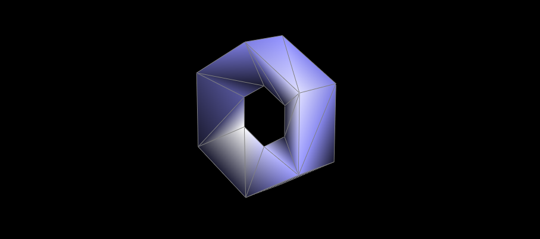

# Homework 9: Average normals for half-edge meshes

In this homework, you will implement the `Vertex::normal` function inside `student_code.cpp`. This function returns the area-weighted average normal vector at a vertex, which can then be used for more realistic local shading compared to thedefault flat shading technique.

In order to compute this value, you will want to use a `HalfedgeIter` to point to the `Halfedge` you are currently keeping track of. A `HalfedgeIter` (analogously `VertexIter, EdgeIter, and FaceIter`) is essentially a pointer to a `Halfedge` (respectively `Vertex, Edge, and Face`), in the sense that you will use `->` to dereference its member functions. Also, you can test whether two different iterators point to the same object using `==`, and you can assign one iterator to point to the same thing as another using `=` (this will NOT make the pointed-to objects have the same value,just as with pointers!).

**Technical implementation caveat:** For this part only, you're implementing a const member function, which means youneed to use `HalfedgeCIters` instead of `HalfedgeIters`. These merely promise not to change the values of the things they point to.

The relevant member functions for this task are `Vertex::halfedge()`, `Halfedge::next()` and `Halfedge::twin()`. You will also need the public member variable `Vector3D Vertex::position`.

How you might use these to begin implementing this function:

At this point, you should

- Save a copy of h's value in another `HalfedgeCIter h_orig`.

- Start a while loop that ends when `h == h_orig`.

- Inside each loop iteration:

    -   Accumulate area-weighted normal of the current face in the variable `n`. You can do this by using the crossproduct of triangle edges. We've defined the cross product for you, so don't re-implement it yourself! Since the cross product of two vectors has a norm equal to twice the area of the triangle they define, these vectorsare already area weighted! 
    
    - Once you've added in the area-weighted normal, you should advance h to the halfedge for the next face by using the `next()` and `twin()` functions.
    
- After the loop concludes, return the re-normalized unit vector `n.unit()`

After completing this part, load up a dae such as `dae/teapot.dae` and press `W` to switch to GLSL shaders and thenpress `Q` to toggle area-averaged normal vectors (which will call on your `Vertex::normal function`). Here's an example of what dae/teapot.dae should look like with correctly implemented area-averaged normals.

    make; ./meshedit ../dae/teapot.dae

